# Ubuntu Server 24.04.4 LTS — Template Maître QCOW2

## Laboratoire KVM / libvirt

---

## Table des matières

1. [Objectif du laboratoire](#1-objectif-du-laboratoire)
2. [Hôte de virtualisation](#2-hôte-de-virtualisation)
3. [Vérifications préalables](#3-vérifications-préalables)
4. [Préparation de la machine virtuelle](#4-préparation-de-la-machine-virtuelle)
5. [Création et configuration du disque](#5-création-et-configuration-du-disque)
6. [Création de la VM — Première tentative](#6-création-de-la-vm--première-tentative)
7. [Diagnostic et correction de l'erreur ISO](#7-diagnostic-et-correction-de-lerreur-iso)
8. [Création de la VM — Deuxième tentative](#8-création-de-la-vm--deuxième-tentative)
9. [Accès VNC et installation](#9-accès-vnc-et-installation)
10. [Installation Ubuntu Server](#10-installation-ubuntu-server)
11. [Post-installation](#11-post-installation)
12. [Première connexion SSH](#12-première-connexion-ssh)
13. [Validation du template](#13-validation-du-template)
14. [Annexes](#14-annexes)

---

## Légende des captures d'écran

| Capture | Étape | Description |
|---------|-------|-------------|
| [1.png](images/1.png) | Écran d'accueil | Sélection de la langue de l'installateur Ubuntu Server |
| [2.png](images/2.png) | Mise à jour disponible | Vérification de la version de l'installateur |
| [3.png](images/3.png) | Configuration clavier | Sélection du layout clavier |
| [4.png](images/4.png) | Type d'installation | Choix entre Ubuntu Server et version minimisée |
| [5.png](images/5.png) | Configuration réseau | Interface réseau enp1s0 avec DHCP |
| [6.png](images/6.png) | Configuration proxy | Configuration du proxy HTTP si nécessaire |
| [7.png](images/7.png) | Miroir Ubuntu | Configuration du miroir des paquets |
| [8.png](images/8.png) | Stockage guidé | Configuration du stockage avec LVM |
| [9.png](images/9.png) | Résumé stockage | Détail du partitionnement |
| [10.png](images/10.png) | Confirmation destructive | Validation avant écriture sur le disque |
| [11.png](images/11.png) | Profil utilisateur | Création de l'utilisateur |
| [12.png](images/12.png) | Ubuntu Pro | Configuration de la mise à niveau |
| [13.png](images/13.png) | Configuration SSH | Installation et configuration du serveur SSH |
| [14.png](images/14.png) | Snaps supplémentaires | Sélection des snaps optionnels |
| [15.png](images/15.png) | Installation en cours | Progression de l'installation |
| [16.png](images/16.png) | Installation terminée | Écran de fin et redémarrage |
| [17.png](images/17.png) | Retrait du CD-ROM | Demande de retrait du support d'installation |
| [18.png](images/18.png) | Connexion VNC perdue | Interruption lors du redémarrage |
| [19.png](images/19.png) | Première connexion SSH | Connexion au système installé |

---

## 1. Objectif du laboratoire

L'objectif est de construire un **template maître Ubuntu Server 24.04.4 LTS amd64**, destiné à être utilisé ultérieurement pour créer des machines virtuelles reproductibles dans l'environnement KVM/libvirt, puis éventuellement dans GNS3/EVE-NG.

### Processus global

```
Ubuntu Server 24.04.4 LTS ISO
             │
             ▼
      Installation propre
             │
             ▼
       Configuration VM
             │
             ▼
       Mises à jour / outils
             │
             ▼
      Nettoyage du système
             │
             ▼
       Validation complète
             │
             ▼
      Template maître QCOW2
             │
             ▼
       Tests de clonage
             │
             ▼
       GNS3 / EVE-NG
```

Le template est volontairement créé à partir de l'ISO Ubuntu, et non à partir d'un ancien disque virtuel. Cette approche permet de partir d'une installation propre et d'éviter de reproduire des configurations ou artefacts provenant d'anciens templates.

---

## 2. Hôte de virtualisation

Le laboratoire est réalisé sur un hôte différent des précédents travaux.

| Propriété | Valeur |
|-----------|--------|
| **Hostname** | x-srv01 |
| **OS** | Ubuntu 24.04.4 LTS |
| **Arch** | x86-64 |
| **Machine ID** | c849c027591e4c73b75ed3d0b1547fb0 |
| **Boot ID** | 3a814aedafec42b496378831483aba6b |
| **Kernel** | Linux 7.0.0-30-generic |
| **Hardware Vendor** | HP |
| **Hardware Model** | HP ENVY x360 Convertible 15m-ed0xxx |
| **Firmware Version** | F.30 |
| **Firmware Date** | Thu 2024-03-28 |

### Commande exécutée

```bash
hostnamectl
```

---

## 3. Vérifications préalables

### 3.1 Adresses réseau de l'hôte

**Commande :**
```bash
hostname -I
```

**Résultat :**
```
192.168.1.17
192.168.121.1
100.126.199.105
192.168.120.1
172.17.0.1
fd7a:115c:a1e0::3437:c76a
```

L'adresse du réseau physique utilisée par l'hôte est notamment : `192.168.1.17`

### 3.2 Vérification du processeur

**Informations pertinentes :**
- Architecture: x86_64
- CPU(s): 8
- Vendor ID: GenuineIntel
- Model name: Intel Core i5-1035G1 CPU @ 1.00GHz
- Virtualization: VT-x
- NUMA node0 CPUs: 0-7

**Validation :** La virtualisation matérielle est disponible avec Intel VT-x.

### 3.3 Inventaire des machines virtuelles existantes

**Commande :**
```bash
virsh list --all
```

**Machines existantes :**
```
eve-ng
proxmox-ve
Srv-centos-stream9
srv-mservice-test
srv01-monitoring
win-xp-Lite
winserver2022
winxp-pc01
x-srvsoc
x-srvsoc2
```

**Décision :** Aucune de ces machines virtuelles ne doit être modifiée ou supprimée. Le nouveau domaine libvirt sera nommé `ubuntu-24.04-template`.

### 3.4 Vérification des outils

| Outil | Version | Statut |
|-------|---------|--------|
| QEMU | 8.2.2 | ✅ |
| libvirt | 10.0.0 | ✅ |
| virt-install | 4.1.0 | ✅ |
| KVM | - | ✅ |

### 3.5 Vérification des réseaux libvirt

**Réseaux existants :**

| Nom | État | Autostart | Mode | Bridge | Plage IP |
|-----|------|-----------|------|--------|----------|
| default | active | yes | NAT | virbr0 | 192.168.120.1/24 |
| lab-net | active | yes | NAT | virbr1 | 192.168.121.1/24 |

**Décision :** Pour l'installation initiale, le réseau utilisé sera **default**.

### 3.6 Vérification du stockage

**Commande :**
```bash
df -h /
```

**Résultat :**
- Total : 468G
- Used : 253G
- Avail : 192G
- Use% : 57%

### 3.7 Pools libvirt

| Pool | État | Répertoire |
|------|------|------------|
| images | active | /var/lib/libvirt/images |
| iso | active | /home/kaman-goumou/lab/kvm/iso |

**Décision importante :** Le pool `iso` a été configuré pour pointer vers le répertoire créé manuellement `/home/kaman-goumou/lab/kvm/iso`. L'ISO sera utilisée directement depuis cet emplacement.

### 3.8 Mémoire disponible

**Commande :**
```bash
free -h
```

**Résultat :**
- Mem total : 23Gi
- Mem used : 1.3Gi
- Mem free : 20Gi
- Mem available : 21Gi
- Swap total : 8.0Gi
- Swap used : 0

**Décision :** La mémoire disponible permet d'attribuer **4 GiB RAM** à la nouvelle VM.

### 3.9 Vérification de l'ISO

**Commande :**
```bash
sha256sum /home/kaman-goumou/lab/kvm/iso/ubuntu-24.04.4-live-server-amd64.iso
```

**Empreinte SHA-256 :**
```
e907d92eeec9df64163a7e454cbc8d7755e8ddc7ed42f99dbc80c40f1a138433
```

**Validation du type :**
```bash
file /home/kaman-goumou/lab/kvm/iso/ubuntu-24.04.4-live-server-amd64.iso
```

**Résultat :**
```
/home/kaman-goumou/lab/kvm/iso/ubuntu-24.04.4-live-server-amd64.iso:
ISO 9660 CD-ROM filesystem data
(DOS/MBR boot sector)
'Ubuntu-Server 24.04.4 LTS amd64'
(bootable)
```

---

## 4. Préparation de la machine virtuelle

### 4.1 Caractéristiques prévues

| Paramètre | Valeur |
|-----------|--------|
| **Nom** | ubuntu-24.04-template |
| **OS** | Ubuntu Server 24.04.4 LTS |
| **Architecture** | amd64 |
| **RAM** | 4096 MiB |
| **vCPU** | 2 |
| **Disque** | 80 GiB |
| **Format** | QCOW2 |
| **Bus disque** | VirtIO |
| **Réseau** | default |
| **Modèle NIC** | VirtIO |
| **ISO** | /home/kaman-goumou/lab/kvm/iso/ubuntu-24.04.4-live-server-amd64.iso |
| **Machine type** | automatique (Q35) |
| **Graphiques** | VNC |

### 4.2 Choix du machine type

**Décision importante :** Le machine type n'a pas été forcé avec `--machine pc`.

- Avec `--machine pc` → interface invitée `ens3`
- Sans forcer → `pc-q35-noble` avec interface invitée `enp1s0`

Pour ce nouveau template, nous laissons `virt-install`/libvirt sélectionner automatiquement le machine type approprié à Ubuntu 24.04.

---

## 5. Création et configuration du disque

### 5.1 Création du disque QCOW2

**Commande :**
```bash
sudo qemu-img create -f qcow2 /var/lib/libvirt/images/ubuntu-24.04-template.qcow2 80G
```

**Résultat :**
```
Formatting '/var/lib/libvirt/images/ubuntu-24.04-template.qcow2',
fmt=qcow2 cluster_size=65536 extended_l2=off
compression_type=zlib size=85899345920
lazy_refcounts=off refcount_bits=16
```

### 5.2 Validation du disque

**Commande :**
```bash
sudo qemu-img info /var/lib/libvirt/images/ubuntu-24.04-template.qcow2
```

**Résultat :**
```
image: /var/lib/libvirt/images/ubuntu-24.04-template.qcow2
file format: qcow2
virtual size: 80 GiB (85899345920 bytes)
disk size: 196 KiB
cluster_size: 65536
Format specific information:
    compat: 1.1
    compression type: zlib
    lazy refcounts: false
    refcount bits: 16
    corrupt: false
    extended l2: false
```

Le disque possède une capacité virtuelle de **80 GiB** mais n'occupe initialement que **196 KiB** sur le stockage physique (allocation dynamique). La vérification indique `corrupt: false`, le disque est donc valide.

### 5.3 Modification des permissions

**Propriétaire initial :**
```
-rw-r--r-- 1 root root 194K Sep 5 15:08 ubuntu-24.04-template.qcow2
```

**Commande de correction :**
```bash
sudo chown libvirt-qemu:kvm /var/lib/libvirt/images/ubuntu-24.04-template.qcow2
```

**Validation :**
```
-rw-r--r-- 1 libvirt-qemu kvm 194K Sep 5 15:08 ubuntu-24.04-template.qcow2
```

---

## 6. Création de la VM — Première tentative

### 6.1 Vérification de l'absence de conflit

**Commande :**
```bash
virsh dominfo ubuntu-24.04-template
```

**Résultat :**
```
error: failed to get domain 'ubuntu-24.04-template'
```

**Validation :** Le nom `ubuntu-24.04-template` est disponible.

### 6.2 Commande de création

```bash
sudo virt-install \
  --name ubuntu-24.04-template \
  --memory 4096 \
  --vcpus 2 \
  --disk path=/var/lib/libvirt/images/ubuntu-24.04-template.qcow2,format=qcow2,bus=virtio \
  --cdrom /home/kaman-goumou/lab/kvm/iso/ubuntu-24.04.4-live-server-amd64.iso \
  --network network=default,model=virtio \
  --os-variant ubuntu24.04 \
  --graphics vnc \
  --noautoconsole
```

### 6.3 Échec

```
WARNING /home/kaman-goumou/lab/kvm/iso/ubuntu-24.04.4-live-server-amd64.iso
may not be accessible by the hypervisor.
You will need to grant the 'libvirt-qemu' user search permissions
for the following directories:
['/home/kaman-goumou']
```

Puis :
```
ERROR internal error: process exited while connecting to monitor:
...
Could not open
'/home/kaman-goumou/lab/kvm/iso/ubuntu-24.04.4-live-server-amd64.iso':
Permission denied
```

---

## 7. Diagnostic et correction de l'erreur ISO

### 7.1 Analyse des permissions

**Commande :**
```bash
namei -l /home/kaman-goumou/lab/kvm/iso/ubuntu-24.04.4-live-server-amd64.iso
```

**Résultat :**
```
f: /home/kaman-goumou/lab/kvm/iso/ubuntu-24.04.4-live-server-amd64.iso
drwxr-xr-x root         root         /
drwxr-xr-x root         root         home
drwxr-x--- kaman-goumou kaman-goumou kaman-goumou
drwxrwxr-x kaman-goumou kaman-goumou lab
drwxrwxr-x kaman-goumou kaman-goumou kvm
drwxrwxr-x kaman-goumou kaman-goumou iso
-rwxr-xr-x libvirt-qemu kvm          ubuntu-24.04.4-live-server-amd64.iso
```

**Problème identifié :** Le répertoire `/home/kaman-goumou` est en `750` (`drwxr-x---`). libvirt-qemu n'étant ni propriétaire ni membre du groupe `kaman-goumou`, il ne peut pas traverser ce répertoire.

### 7.2 Vérification des ACL existantes

**Commande :**
```bash
getfacl -p /home/kaman-goumou
```

**Résultat :**
```
# file: /home/kaman-goumou
# owner: kaman-goumou
# group: kaman-goumou
user::rwx
group::r-x
other::---
```

### 7.3 Correction avec ACL

Plutôt que de rendre le répertoire accessible à tous les utilisateurs avec `chmod 755`, une correction plus restrictive a été appliquée :

```bash
sudo setfacl -m u:libvirt-qemu:--x /home/kaman-goumou
```

Cette ACL donne uniquement à libvirt-qemu le droit de traverser le répertoire.

### 7.4 Validation de la correction

**Commande :**
```bash
getfacl -p /home/kaman-goumou
```

**Résultat :**
```
# file: /home/kaman-goumou
# owner: kaman-goumou
# group: kaman-goumou
user::rwx
user:libvirt-qemu:--x
group::r-x
mask::r-x
other::---
```

**Validation :** L'ACL spécifique est maintenant présente : `user:libvirt-qemu:--x`

---

## 8. Création de la VM — Deuxième tentative

### 8.1 Commande relancée

```bash
sudo virt-install \
  --name ubuntu-24.04-template \
  --memory 4096 \
  --vcpus 2 \
  --disk path=/var/lib/libvirt/images/ubuntu-24.04-template.qcow2,format=qcow2,bus=virtio \
  --cdrom /home/kaman-goumou/lab/kvm/iso/ubuntu-24.04.4-live-server-amd64.iso \
  --network network=default,model=virtio \
  --os-variant ubuntu24.04 \
  --graphics vnc \
  --noautoconsole
```

### 8.2 Succès

```
Starting install...
Creating domain... | 0 B 00:00:00
Domain is still running. Installation may be in progress.
You can reconnect to the console to complete the installation process.
```

**Validation :** La création de la VM a réussi. L'ISO est désormais correctement accessible par QEMU/libvirt.

---

## 9. Accès VNC et installation

### 9.1 Vérification VNC

**Commande :**
```bash
sudo virsh vncdisplay ubuntu-24.04-template
```

**Résultat :**
```
127.0.0.1:0
```

Le display `:0` correspond au port `5900/TCP`.

### 9.2 Tunnel SSH

Comme VNC écoute uniquement sur `127.0.0.1:5900`, un tunnel SSH a été établi depuis le Mac :

```bash
ssh -L 5900:127.0.0.1:5900 kaman-goumou@192.168.120.1
```

**Fonctionnement :**
```
Mac
 │
 │ localhost:5900
 │
 │ SSH tunnel
 ▼
x-srv01
 │
 │ 127.0.0.1:5900
 ▼
QEMU
 │
 ▼
ubuntu-24.04-template
```

### 9.3 Écran initial

Le client TigerVNC connecté sur `127.0.0.1:5900` affiche l'écran de l'installateur Ubuntu Server 24.04.4 LTS.

---

## 10. Installation Ubuntu Server

### 10.1 Écran d'accueil — Sélection de la langue

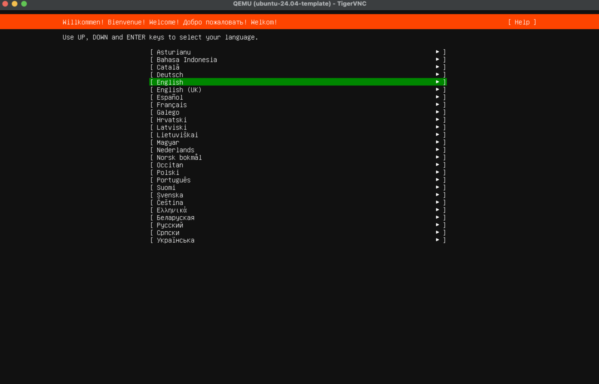

**Écran présenté :**
```
Wilkommen! Bienvenue! Welcome! Добро пожаловать! Welkom!

Use UP, DOWN and ENTER keys to select your language.

[ Asturianu
[ Bahasa Indonesia
[ Català
[ Deutsch
[ English
[ English (UK)
[ Español
[ Français
[ Galego
...
```

**Décision :** La langue `[ English ]` a été sélectionnée et validée avec `Enter`.

---

### 10.2 Mise à jour de l'installateur

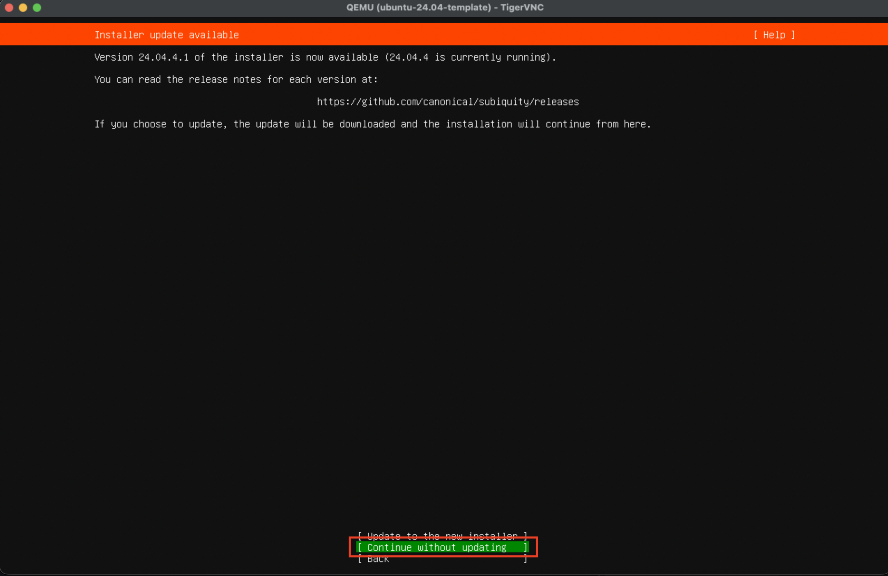

```
Installer update available

Version 24.04.4.1 of the installer is now available (24.04.4 is currently running).

[ Update to the new installer ]
[ Continue without updating ]
```

**Décision :** `[ Continue without updating ]` a été sélectionné pour éviter toute modification du comportement attendu de l'installation.

---

### 10.3 Configuration clavier

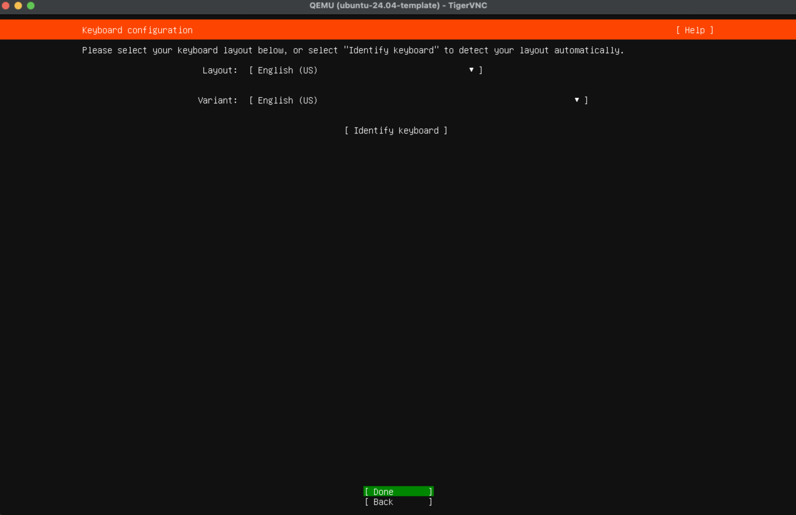

```
Keyboard configuration

Layout: [ English (US) ▼ ]
Variant: [ English (US) ▼ ]

[ Identify keyboard ]
```

**Décision :** La configuration par défaut `English (US)` a été conservée et validée avec `Done`.

---

### 10.4 Type d'installation

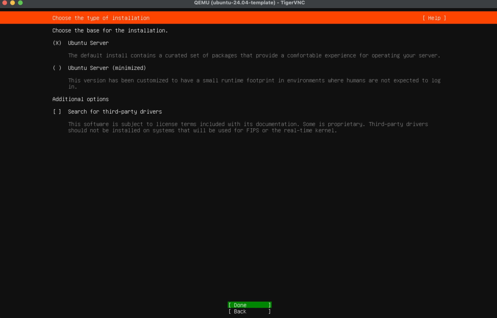

```
Choose the type of installation

(X) Ubuntu Server
( ) Ubuntu Server (minimized)

Additional options
[ ] Search for third-party drivers

[ Done ] [ Back ]
```

**Décision :** `(X) Ubuntu Server` a été sélectionné.

---

### 10.5 Configuration réseau

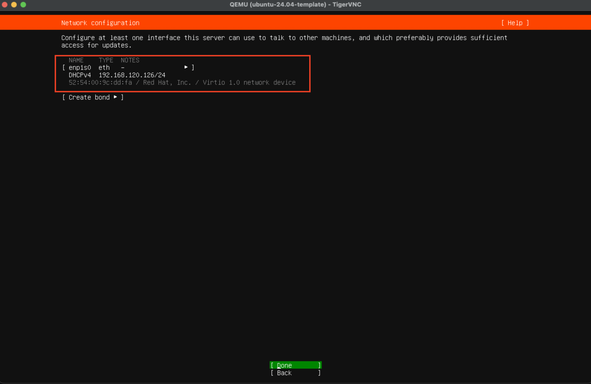

```
Network configuration

NAME    TYPE    NOTES
[ enp1s0  eth   -    ]
DHCPv4    192.168.120.126/24
52:54:00:9c:dd:fa / Red Hat, Inc. / Virtio 1.0 network device

[ Create bond ]
```

**Adresse IP obtenue :** `192.168.120.126/24`

**Décision :** La configuration DHCP par défaut a été conservée.

---

### 10.6 Configuration proxy

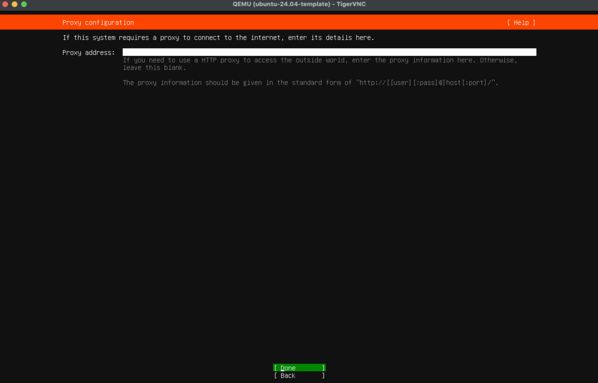

```
Proxy configuration

Proxy address:

[ Done ] [ Back ]
```

**Décision :** Aucun proxy n'a été configuré (champ laissé vide).

---

### 10.7 Miroir Ubuntu

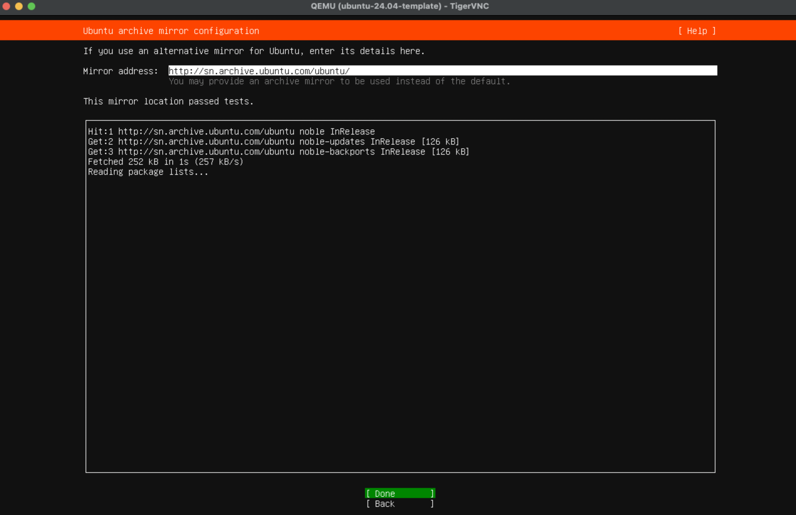

```
Ubuntu archive mirror configuration

Mirror address: http://sn.archive.ubuntu.com/ubuntu/

Hit:1 http://sn.archive.ubuntu.com/ubuntu noble InRelease
Get:2 http://sn.archive.ubuntu.com/ubuntu noble-updates InRelease [126 kB]
Get:3 http://sn.archive.ubuntu.com/ubuntu noble-backports InRelease [126 kB]
Fetched 252 kB in 15 (257 kB/s)

[ Done ] [ Back ]
```

**Décision :** Le miroir par défaut a été conservé.

---

### 10.8 Configuration du stockage

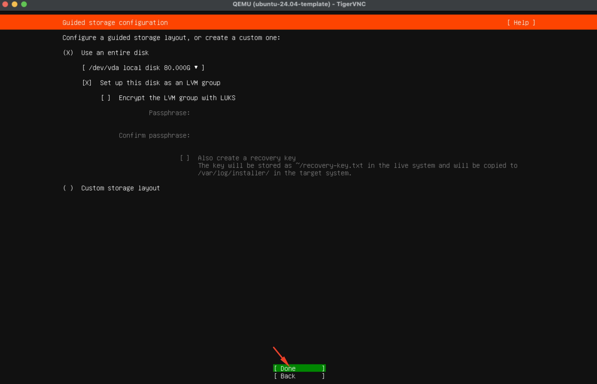

```
Guided storage configuration

(X) Use an entire disk
[ /dev/vda local disk 80.000G * ]

[X] Set up this disk as an LVM group
[ ] Encrypt the LVM group with LUKS
```

**Décision :** `(X) Use an entire disk` avec `[X] Set up this disk as an LVM group` a été sélectionné.

---

### 10.9 Détail du partitionnement

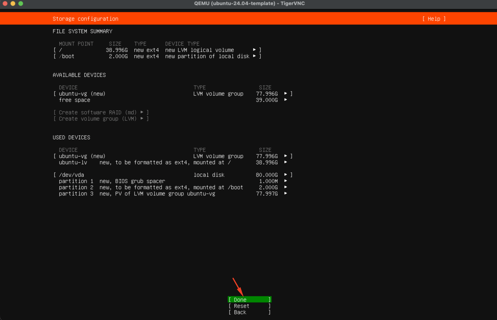

**File System Summary :**
| Mount Point | Size | Type | Device Type |
|-------------|------|------|-------------|
| / | 38.996G | new ext4 | new LVM logical volume |
| /boot | 2.000G | new ext4 | new partition of local disk |

**Validation :** Le partitionnement a été validé avec `Done`.

---

### 10.10 Confirmation destructive

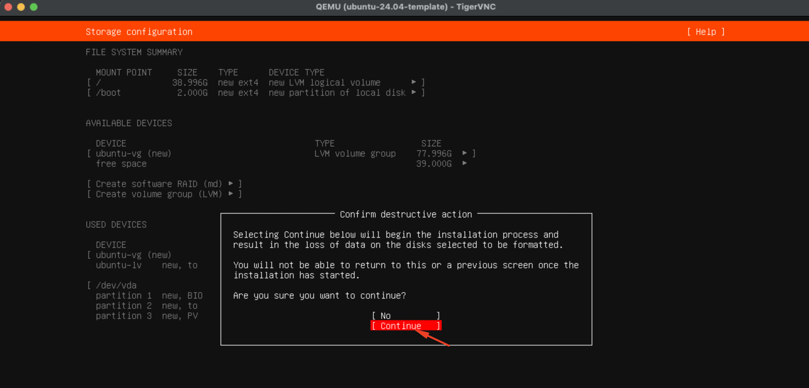

```
Confirm destructive action

Selecting Continue below will begin the installation process and result in the loss of data on the disks selected to be formatted.

Are you sure you want to continue?

[ No ] [ Continue ]
```

**Décision :** `[ Continue ]` a été sélectionné pour lancer l'installation.

---

### 10.11 Profil utilisateur

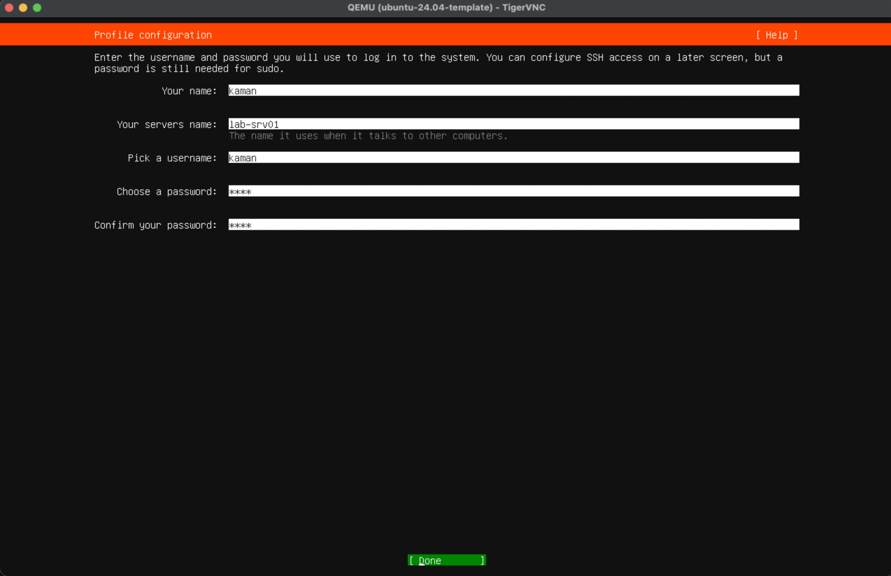

```
Profile configuration

Your name: kaman
Your servers name: lab-srv01
Pick a username: kaman
Choose a password: *****
Confirm your password: *****
```

**Décision :** Le nom de la VM a été défini sur `lab-srv01`.

---

### 10.12 Ubuntu Pro

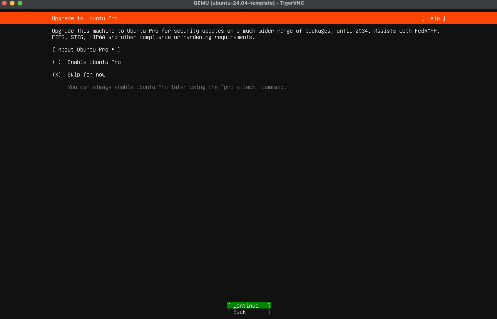

```
Upgrade to Ubuntu Pro

( ) Enable Ubuntu Pro
(X) Skip for now
```

**Décision :** `(X) Skip for now` a été sélectionné.

---

### 10.13 Configuration SSH

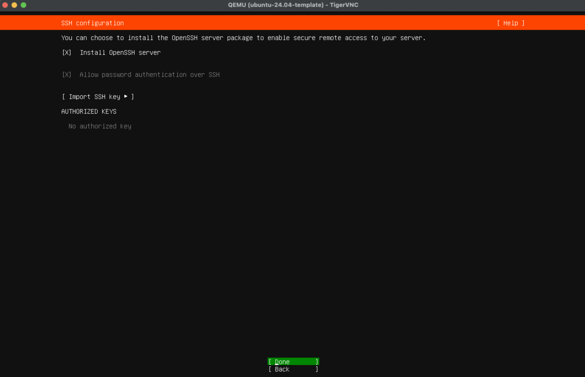

```
SSH configuration

[X] Install OpenSSH server
[X] Allow password authentication over SSH
[ Import SSH key ▸ ]

AUTHORIZED KEYS
No authorized key
```

**Décision :** L'installation du serveur SSH a été activée, avec authentification par mot de passe autorisée.

---

### 10.14 Snaps supplémentaires

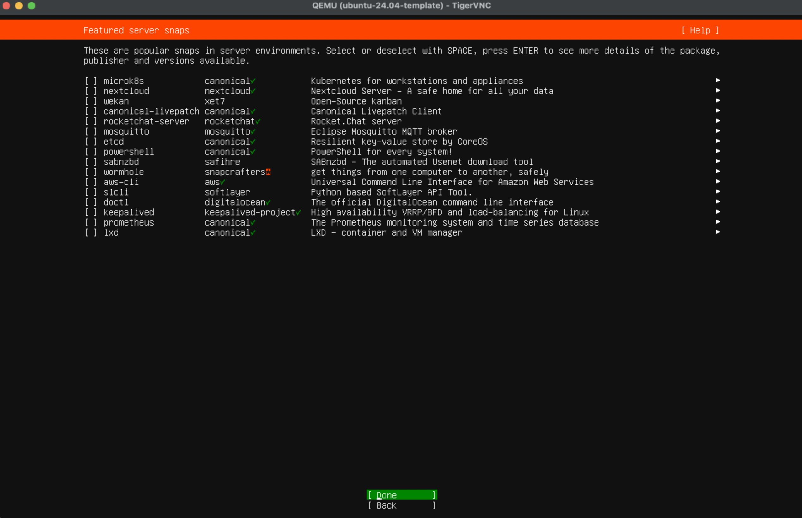

```
Featured server snaps

[ ] microk8s    canonical/
[ ] nextcloud   nextcloud
[ ] wekan       xet7
[ ] canonical-livepatch    canonical/
[ ] rocketchat-server    rocketchat/
...
```

**Décision :** Aucun snap supplémentaire n'a été sélectionné.

---

### 10.15 Installation en cours

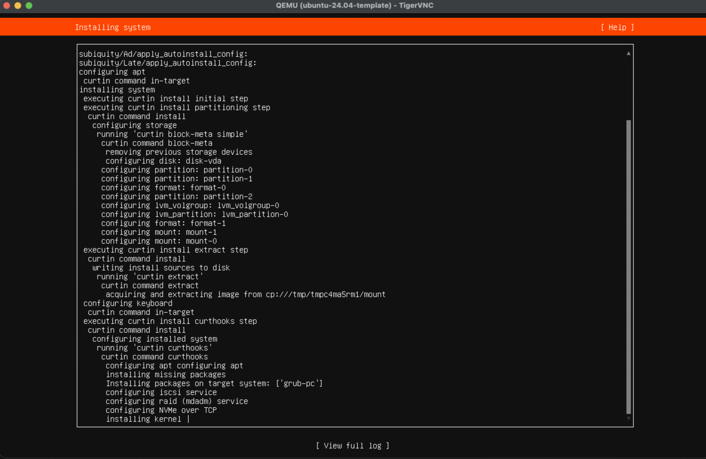

L'écran affiche les étapes en cours :
- Configuration du stockage
- Partitionnement
- Création des volumes LVM
- Formatage
- Configuration APT
- Installation des paquets
- Configuration du système

---

### 10.16 Installation terminée

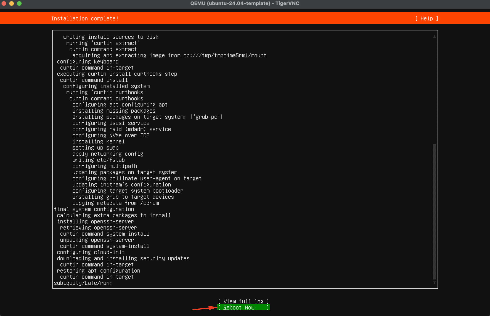

```
Installation complete!

[ View full log ]
[ Reboot Now ]
```

**Décision :** `[ Reboot Now ]` a été sélectionné.

---

### 10.17 Retrait du CD-ROM

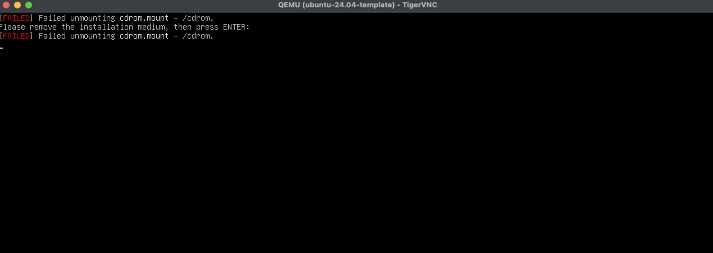

```
[FAILED] Failed unmounting cdrom.mount - /cdrom.
Please remove the installation medium, then press ENTER:
```

**Action :** `Enter` a été pressé après le message.

---

### 10.18 Interruption VNC

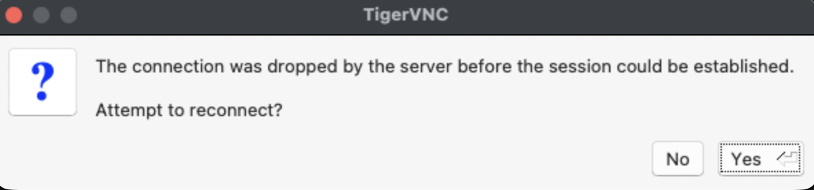

```
TigerVNC

The connection was dropped by the server before the session could be established.

Attempt to reconnect?

[ No ] [ Yes ]
```

La connexion VNC a été interrompue pendant le redémarrage de la VM.

---

## 11. Post-installation

### 11.1 Vérification de l'état de la VM

**Commande :**
```bash
virsh list --all
```

**Résultat :**
```
ubuntu-24.04-template   shut off
```

La VM est arrêtée suite au redémarrage demandé par l'installateur.

### 11.2 Démarrage manuel de la VM

**Commande :**
```bash
virsh start ubuntu-24.04-template
```

**Résultat :**
```
Domain 'ubuntu-24.04-template' started
```

### 11.3 Vérification des périphériques

**Commande :**
```bash
sudo virsh domblklist ubuntu-24.04-template --details
```

**Résultat :**
```
Type   Device   Target   Source
--------------------------------------------------------------------
file   disk     vda      /var/lib/libvirt/images/ubuntu-24.04-template.qcow2
file   cdrom    sda      -
```

Le lecteur CD-ROM est maintenant indiqué avec `Source -`, confirmant qu'aucun média ISO n'est attaché.

---

## 12. Première connexion SSH

### 12.1 Connexion

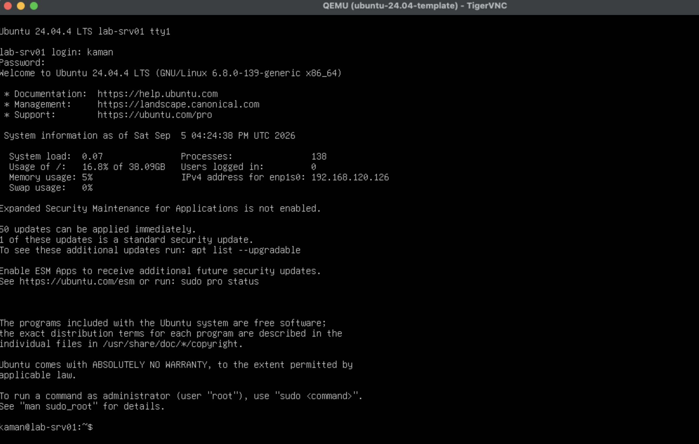

```bash
ssh kaman@192.168.120.126
```

**Résultat :**
```
Welcome to Ubuntu 24.04.4 LTS (GNU/Linux 6.8.0-139-generic x86_64)

System information as of Sat Sep 5 04:24:38 PM UTC 2026

System load: 0.07
Usage of /: 16.8% of 38.09GB
Memory usage: 5%
Swap usage: 0%

Processes: 138
Users logged in: 0
IPv4 address for enp1s0: 192.168.120.126
```

### 12.2 Vérification du système

**Commande :**
```bash
hostnamectl
```

**Résultat :**
```
Static hostname: lab-srv01
       Icon name: computer-vm
         Chassis: vm
  Virtualization: kvm
Operating System: Ubuntu 24.04.4 LTS
          Kernel: Linux 6.8.0-139-generic
    Architecture: x86-64
 Hardware Vendor: QEMU
  Hardware Model: Ubuntu 24.04 PC _Q35 + ICH9, 2009_
Firmware Version: 1.16.3-debian-1.16.3-2
Firmware Date: Tue 2014-04-01
```

---

## 13. Validation du template

### État actuel validé

| Élément | Statut |
|---------|--------|
| Installation Ubuntu | ✅ VALIDÉE |
| Création du disque QCOW2 | ✅ VALIDÉE |
| Disque virtuel 80 GiB | ✅ VALIDÉ |
| Accès libvirt au disque | ✅ VALIDÉ |
| Accès libvirt à l'ISO | ✅ VALIDÉ |
| Correction ACL | ✅ VALIDÉE |
| Création de la VM | ✅ VALIDÉE |
| Démarrage manuel après installation | ✅ VALIDÉ |
| CD-ROM sans média | ✅ VALIDÉ |
| Démarrage sur le disque QCOW2 | ✅ VALIDÉ |
| Réseau VirtIO | ✅ VALIDÉ |
| DHCP | ✅ VALIDÉ |
| SSH | ✅ VALIDÉ |
| Ubuntu 24.04.4 LTS | ✅ VALIDÉ |
| Virtualisation KVM | ✅ VALIDÉE |
| Hostname lab-srv01 | ✅ VALIDÉ |

---

### 13.1 Observation concernant l'espace disque

**Lors de la connexion SSH, Ubuntu affichait :**
```
Usage of /: 16.8% of 38.09GB
```

**Alors que le disque virtuel a été créé avec :**
```
80 GiB
```

**Analyse :** Le partitionnement créé par l'installateur n'utilise pas encore la totalité du disque virtuel. Le volume LVM `ubuntu-lv` a été configuré avec **~39 GB**, laissant un espace libre d'environ **39 GB** dans le groupe de volumes LVM.

**Aucune modification du partitionnement n'a encore été effectuée.**

### ⚠️ Important

Le template n'est pas encore considéré comme finalisé. Les opérations suivantes restent à effectuer :

- [ ] Vérification détaillée du partitionnement
- [ ] Extension du volume LVM si nécessaire
- [ ] Vérification du système de fichiers
- [ ] Vérification des services installés
- [ ] Vérification réseau approfondie
- [ ] Nettoyage de l'installation
- [ ] Suppression des fichiers temporaires
- [ ] Nettoyage des logs
- [ ] Vérification cloud-init
- [ ] Préparation pour le clonage
- [ ] Nettoyage des identifiants/machine ID
- [ ] Validation finale
- [ ] Arrêt propre de la VM
- [ ] Vérification et optimisation finale du QCOW2
- [ ] Création de la version maître du template
- [ ] Tests de clonage

---

## 14. Annexes

### 14.1 Journal des erreurs et corrections

#### Erreur #1 — ISO inaccessible par QEMU

| Élément | Détail |
|---------|--------|
| **Symptôme** | `Could not open '/home/kaman-goumou/lab/kvm/iso/ubuntu-24.04.4-live-server-amd64.iso': Permission denied` |
| **Cause** | libvirt-qemu avait accès au fichier ISO mais ne pouvait pas traverser `/home/kaman-goumou` (750) |
| **Diagnostic** | `namei -l` et `getfacl -p` |
| **Correction** | `sudo setfacl -m u:libvirt-qemu:--x /home/kaman-goumou` |
| **Validation** | `getfacl -p /home/kaman-goumou` a confirmé `user:libvirt-qemu:--x` |
| **Résultat** | La deuxième tentative de virt-install a réussi ✅ |

#### Erreur #2 — Commande du avec caractère générique

| Élément | Détail |
|---------|--------|
| **Commande** | `sudo du -sh /var/lib/libvirt/images/*` |
| **Résultat** | `du: cannot access '/var/lib/libvirt/images/*': No such file or directory` |
| **Correction** | Vérification directe avec `sudo ls -lah /var/lib/libvirt/images` |
| **État** | Anomalie documentée ; aucune modification effectuée |

---

### 14.2 Résumé des captures d'écran

| # | Fichier | Description | Étape |
|---|---------|-------------|-------|
| 1 | 1.png | Écran d'accueil | Sélection de la langue |
| 2 | 2.png | Mise à jour disponible | Installation |
| 3 | 3.png | Configuration clavier | Installation |
| 4 | 4.png | Type d'installation | Installation |
| 5 | 5.png | Configuration réseau | Installation |
| 6 | 6.png | Configuration proxy | Installation |
| 7 | 7.png | Miroir Ubuntu | Installation |
| 8 | 8.png | Stockage guidé | Installation |
| 9 | 9.png | Résumé stockage | Installation |
| 10 | 10.png | Confirmation destructive | Installation |
| 11 | 11.png | Profil utilisateur | Installation |
| 12 | 12.png | Ubuntu Pro | Installation |
| 13 | 13.png | Configuration SSH | Installation |
| 14 | 14.png | Snaps supplémentaires | Installation |
| 15 | 15.png | Installation en cours | Installation |
| 16 | 16.png | Installation terminée | Post-installation |
| 17 | 17.png | Retrait du CD-ROM | Post-installation |
| 18 | 18.png | Connexion VNC perdue | Post-installation |
| 19 | 19.png | Première connexion SSH | Validation |

---

### 14.3 Références

| Référence | Valeur |
|-----------|--------|
| **ISO SHA-256** | `e907d92eeec9df64163a7e454cbc8d7755e8ddc7ed42f99dbc80c40f1a138433` |
| **Nom VM** | ubuntu-24.04-template |
| **Hostname invité** | lab-srv01 |
| **Adresse IP** | 192.168.120.126 |
| **Interface** | enp1s0 |
| **Type machine** | pc-q35-noble |
| **Version kernel** | 6.8.0-139-generic |

---

*Document créé à partir du journal technique des opérations exécutées.*  
*Toutes les commandes, résultats, erreurs et corrections sont documentés tels que réellement exécutés.*
